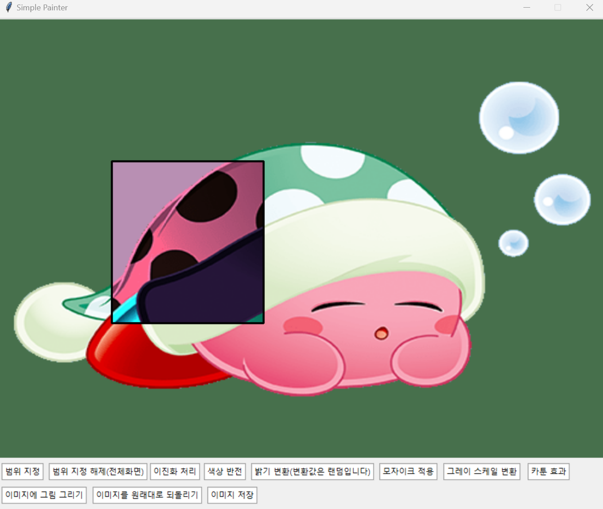
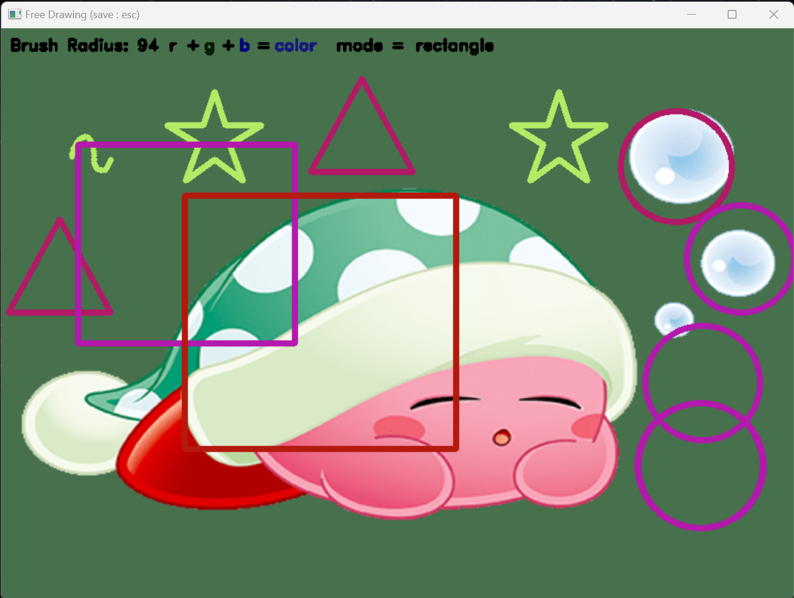

# OpenCV_TERM_PJ

My Computer VIsion Final Project

****

## 프로젝트 제목 : My_Simple_Painter(Photoshop)

### 개요

이전에 hw1로 제출한 Free_drawing_extended의 매우 매우 발전된 버전입니다. 

원하시는 사진을 업로드하고 여러 버튼을 클릭하여 자신의 입맛대로 사진을 편집하거나 무언가를 그리세요!

### 기본 화면

기본적인 틀은 https://076923.github.io/posts/Python-tkinter-32/의 글을 참고하였습니다.

기본적으로 kirby_sleep.png가 업로드 되어 있고 

코드의  'src = cv2.imread("kirby_sleep.png")' 부분에서(약 335번째 줄) 자신이 원하는 사진을 업로드하세요!

### 버튼 설명

1.  범위 지정
   - 
   - 마우스로 드래그하여 사진이 편집될 범위를 정하고, 스페이스바를 눌러 정한 범위를 확정합니다.
   
2. 범위 지정 해제

   - 지정한 범위를 해제하고 사진이 편집될 범위를 사진 전체로 바꿉니다.

3.  이진화 처리

   - 
   - 지정한 이미지 범위에 이진화 처리를 적용시킵니다.
   - 마찬가지로 https://076923.github.io/posts/Python-tkinter-32/의 글을 참고하였습니다.
   
4.  색상 반전
   - 
   - 지정한 이미지 범위에 색상 반전을 적용시킵니다.
   
5. 밝기 변환

   - 
   - 지정한 이미지 범위의 이미지 밝기(intensity)를 변환합니다.
   -  contrast와 brightness 값은 랜덤입니다. (contrast(또는 brightness) + step * (-10 ~ +10))

6. 모자이크 적용

   - 

   - 지정한 이미지 범위에 모자이크를 적용시킵니다.

   - 모자이크 적용 방법은 https://bkshin.tistory.com/entry/OpenCV-16-%EB%AA%A8%EC%9E%90%EC%9D%B4%ED%81%AC-%EC%B2%98%EB%A6%ACMosaic-%EB%A6%AC%ED%80%B4%ED%8C%8C%EC%9D%B4Liquify-%EC%99%9C%EA%B3%A1-%EA%B1%B0%EC%9A%B8Distortion-Mirror를 

     참고하였습니다

7. 그레이 스케일 변환

   - 

   - 지정한 이미지 범위를 그레이 스케일로 변환시킵니다.

8. 카툰 효과

   - 
   - 지정한 이미지 범위에 카툰 효과를 적용시킵니다.
   - 카툰 필터 적용 방법은 https://deep-learning-study.tistory.com/173을 참고하였습니다.

9. 이미지에 그림 그리기

   - 

   - 기존 Free_drawing_extended를 가져와 약간의 수정 작업을 거쳐, 사진 내에서 그림을 그릴 수 있게 

     하였습니다.

   - '+', '-' 키로 brush의 크기를 조절합니다.

   - 'u', 'd' 키로 red, green, blue를 선택할 수 있으며, 'spacebar' 키로 지정한 색의 채도를 올릴 수 있습니다.

     (채도가 255를 넘으면 다시 0으로 돌아감)

   - 'c', 'r', 't'키로 각각 원, 사각형, 삼각형을 선택할 수 있으며, 'f'키로 다시 일반적인 그리기 모드로 

     전환합니다.(자유롭게 선을 그림)

   - 별 그리기 모드가 추가되었습니다!  's'키를 눌러 선택할 수 있습니다.

   - 'e'키를 눌러 팔레트를 초기화시킬 수 있습니다.

   - 그리기를 완료했다면 'esc'키를 눌러 그린 도형들과 그림들을 화면에 적용시킬 수 있습니다.

10. 이미지를 원래대로 되돌리기

    - 편집한 이미지를 원상태로 되돌립니다.

11. 이미지 저장

    - 편집한 이미지를 지정된 경로에 지정된 형식으로 저장합니다

    - 지정된 경로와 형식은 코드의 'cv2.imwrite("C:/Users/kirby_sleep_edit.png", img)' 부분에서

      (약 318번째 줄) 편집할 수 있습니다.

      

### 참고 자료

-   https://076923.github.io/posts/Python-tkinter-32/
-  https://bkshin.tistory.com/entry/OpenCV-16-%EB%AA%A8%EC%9E%90%EC%9D%B4%ED%81%AC-%EC%B2%98%EB%A6%ACMosaic-%EB%A6%AC%ED%80%B4%ED%8C%8C%EC%9D%B4Liquify-%EC%99%9C%EA%B3%A1-%EA%B1%B0%EC%9A%B8Distortion-Mirror
- https://deep-learning-study.tistory.com/173
- 기타 컴퓨터비전 수업 시간에 활용한 모든 ppt.

### 

